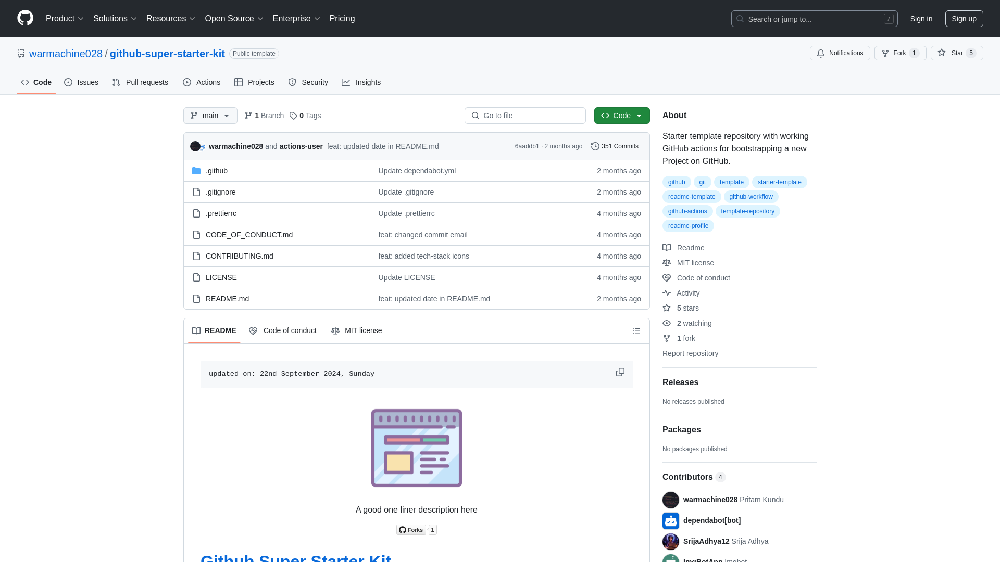

    updated on: 24th July 2025, Thursday

    
    
 A Meeting Application 

    

# [You_me](https://github.com/SrijaAdhya12/You_Me)

![line]

## Table of Contents

- [Introduction](#introduction)
- [Developement](#developement)
- [Tech Stack Used](#tech-stack-used)
- [Preview](#preview)
- [Best Contributors](#best-contributors)
- [License](#license)

![line]

## Introduction
- FullStack Meeting App based on Next.js And Stream Video SDK

![line]

## Developement

- Steps used for development of this project
- Build processes
- CI/CD commands
- Docker commands

![line]

## Tech Stack Used

- GitHub
- Markdown
- Prettier
- Dependabot
- GitHub Actions
- Yaml
- JavaScript

      

![line]

## Preview

<picture align="center">
    <source media="(prefers-color-scheme: light)" srcset=".github/preview-light.png">
    <source media="(prefers-color-scheme: dark)" srcset=".github/preview-dark.png">
    
</picture>

![line]

## Best Contributors

    

![line]

## License

- See [LICENSE]

**SrijaAdhya12, 2024**

![line]

## Thank you, everyone 💚

[icons]: https://icons8.com
[markdown-badges]: https://github.com/Ileriayo/markdown-badges
[custom-icons]: https://simpleicons.org
[line]: https://user-images.githubusercontent.com/75939390/137615281-3a875960-92cc-407f-97fe-fd2319bdb252.png
[License]: https://github.com/SrijaAdhya12/You_Me/blob/main/LICENSE

<!-- 24/07/25 -->
